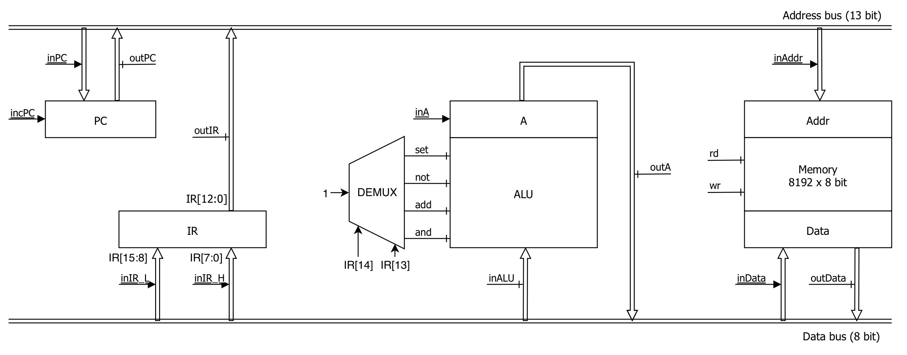
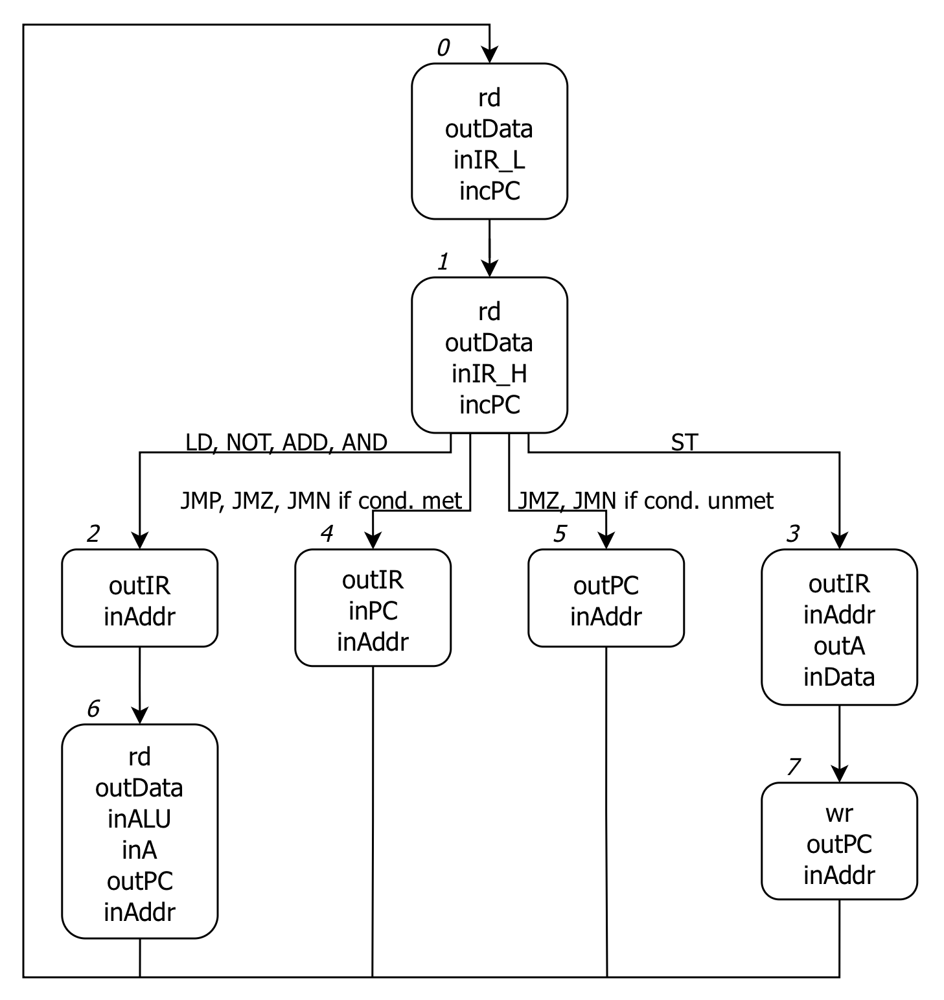

# Hypothetical microarchitecture of W16

This diagram shows the data path of W16 with all major components and control signals used to propagate data between them.

## Components

- IR - instruction register, 16 bits wide. Stores the currently processed instruction. Three most significant bits, IR[13], IR[14] and IR[15], are used by the control store to determine what control signals need to be activated in the current state.
- PC - program counter, 13 bits wide - in state 0 it stores the memory address of the currently executed instruction. In subsequent states it stores the memory address of the next instruction to be executed.
- ALU - arithmetic-logic unit - performs operations on the value of the register A.
- A - accumulator - a general purpose register.
- Addr - address register - stores the address to which data is written, or from which data is loaded.
- Memory - Abstract representation of the memory mapping.
- Data - data register - stores data loaded from memory, or data to be written to memory.

## Control signals

Control signals are used to facilitate the data flow between the components. A clock circuit produces cycles of alternating low and high logic levels at fixed intervals and activates control signals. The state machine determines which signals should be active during each cycle.

Not underlined are level control signals, active during the high level of the clock signal. Underlined are impulse control signals, activated at the falling edge a clock cycle.

- <u>incPC</u> - increments the value of PC by one,
- <u>inPC</u> - loads the value from the address bus to PC,
- outPC - propagates the value of PC to the address bus,
- <u>inIR_L</u> - loads the value from the data bus to the least significant 8 bits of the IR,
- <u>inIR_H</u> - loads the value from the data bus to the most significant 8 bits of the IR,
- outIR - propagates the value from the least significant 13 bits of IR to the address bus,
- inALU - loads the value from the data bus to ALU,
- set, not, add, and - selects the operation to be performed by the ALU between the value loaded from the data bus and the register A. Activation of these control signals is not determined by the state machine, instead by a demultiplexer using the third and second most significant bits of IR,
- <u>inA</u> - loads the result of ALU computation into the register A,
- outA - propagates the value from the register A to the data bus,
- <u>inAddr</u> - loads the value from the address bus into the Addr register,
- <u>inData</u> - loads the value from the data bus into the Data register,
- outData - propagates the value from the Data register in the data bus,
- rd - loads the value from the memory address in the Addr registers into the Data register,
- wr - writes the data from the Data register to the memory at the address stored in the Addr register.

## State machine

The state machine determines what signals are active during each state and what the next state in the next clock cycle will be based on the current state, the opcode in the most significant 3 bits of IR, and the value in the register A.

## Control store

The control store formally describes state transitions.

N = A[7]

Z = ~(A[7] | A[6] | ... | A[1] | A[0])

x is any logic level

| state[2] | state[1] | state[0] | IR[15] | IR[14] | IR[13] | N | Z | next state[2] | next state[1] | next state[0] |
|:-:|:-:|:-:|:-:|:-:|:-:|:-:|:-:|:-:|:-:|:-:|
| 0 | 0 | 0 | x | x | x | x | x | 0 | 0 | 1 |
| 0 | 0 | 1 | 0 | x | x | x | x | 0 | 1 | 0 |
| 0 | 0 | 1 | 1 | 0 | 0 | x | x | 0 | 1 | 1 |
| 0 | 0 | 1 | 1 | 0 | 1 | x | x | 1 | 0 | 0 |
| 0 | 0 | 1 | 1 | 1 | 0 | 0 | x | 1 | 0 | 1 |
| 0 | 0 | 1 | 1 | 1 | 0 | 1 | x | 1 | 0 | 0 |
| 0 | 0 | 1 | 1 | 1 | 1 | x | 0 | 1 | 0 | 1 |
| 0 | 0 | 1 | 1 | 1 | 1 | x | 1 | 1 | 0 | 0 |
| 0 | 1 | 0 | x | x | x | x | x | 1 | 1 | 0 |
| 0 | 1 | 1 | x | x | x | x | x | 1 | 1 | 1 |
| 1 | x | x | x | x | x | x | x | 0 | 0 | 0 |